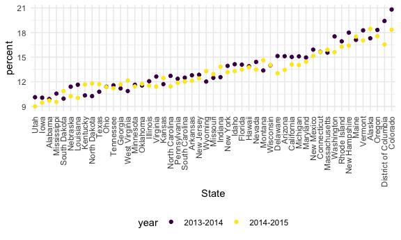
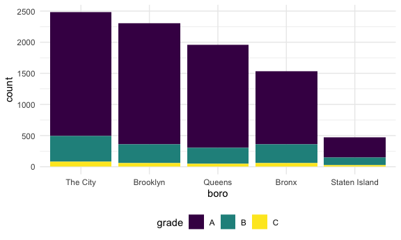

data\_wrangling\_ii
================
Anyu Zhu
10/19/2021

``` r
library(rvest)
library(httr)
library(tidyverse)
```

    ## ── Attaching packages ─────────────────────────────────────── tidyverse 1.3.1 ──

    ## ✓ ggplot2 3.3.3     ✓ purrr   0.3.4
    ## ✓ tibble  3.1.0     ✓ dplyr   1.0.5
    ## ✓ tidyr   1.1.3     ✓ stringr 1.4.0
    ## ✓ readr   1.4.0     ✓ forcats 0.5.1

    ## ── Conflicts ────────────────────────────────────────── tidyverse_conflicts() ──
    ## x dplyr::filter()         masks stats::filter()
    ## x readr::guess_encoding() masks rvest::guess_encoding()
    ## x dplyr::lag()            masks stats::lag()

``` r
library(p8105.datasets)

knitr::opts_chunk$set(
  fig.width = 6,
  fig.asp = .6,out.width = "90%"
  )

theme_set(theme_minimal() + theme(legend.position = "bottom"))

options(
  ggplot2.continuous.colour = "viridis",
  ggplot2.continuous.fill = "viridis"
)

scale_colour_discrete = scale_colour_viridis_d
scale_fill_discrete = scale_fill_viridis_d
```

## NSDUH Data

``` r
url = "http://samhda.s3-us-gov-west-1.amazonaws.com/s3fs-public/field-uploads/2k15StateFiles/NSDUHsaeShortTermCHG2015.htm"

drug_use_html = read_html(url) 

drug_use_df = 
  drug_use_html %>% 
  html_table() %>% 
  first() %>% 
  slice(-1) # delete note
```

## Star wars

Get star wars data:

``` r
sw_url = "https://www.imdb.com/list/ls070150896/"

sw_html = 
  read_html(sw_url)

sw_titles = sw_html %>% 
  html_elements(".lister-item-header a") %>% 
  html_text()

sw_revenue = 
  sw_html %>% 
  html_elements(".text-muted .ghost~ .text-muted+ span") %>% 
  html_text()

sw_df = 
  tibble(
    title = sw_titles,
    rev = sw_revenue)
```

Dynamite review:

``` r
dynamite_url = "https://www.amazon.com/product-reviews/B00005JNBQ/ref=cm_cr_arp_d_viewopt_rvwer?ie=UTF8&reviewerType=avp_only_reviews&sortBy=recent&pageNumber=1"

dynamite_html = read_html(dynamite_url)

dynamite_titles = dynamite_html %>% 
  html_elements(".a-text-bold span") %>% 
  html_text()

dynamite_stars = dynamite_html %>% 
  html_elements("#cm_cr-review_list .review-rating") %>% 
  html_text()

dynamite_df = tibble(
  title = dynamite_titles,
  stars = dynamite_stars,
)
```

## Try some APIs

Get data from API about water: (.csv)

``` r
water_df = 
  GET("https://data.cityofnewyork.us/resource/ia2d-e54m.csv") %>% 
  content()
```

    ## 
    ## ── Column specification ────────────────────────────────────────────────────────
    ## cols(
    ##   year = col_double(),
    ##   new_york_city_population = col_double(),
    ##   nyc_consumption_million_gallons_per_day = col_double(),
    ##   per_capita_gallons_per_person_per_day = col_double()
    ## )

(.json)

``` r
water_df2 = 
  GET("https://data.cityofnewyork.us/resource/ia2d-e54m.json") %>% 
  content("text") %>% 
  jsonlite::fromJSON() %>% 
  as_tibble()
```

BRFSS

``` r
brfss_df = 
  GET("https://chronicdata.cdc.gov/resource/acme-vg9e.csv",
      query = list("$limit" = 5000)) %>% 
  content()
```

    ## 
    ## ── Column specification ────────────────────────────────────────────────────────
    ## cols(
    ##   .default = col_character(),
    ##   year = col_double(),
    ##   sample_size = col_double(),
    ##   data_value = col_double(),
    ##   confidence_limit_low = col_double(),
    ##   confidence_limit_high = col_double(),
    ##   display_order = col_double(),
    ##   locationid = col_logical()
    ## )
    ## ℹ Use `spec()` for the full column specifications.

Pokemon

``` r
poke_data = 
  GET("http://pokeapi.co/api/v2/pokemon/1") %>% 
  content()

poke_data[["name"]]
```

    ## [1] "bulbasaur"

``` r
poke_data[["height"]]
```

    ## [1] 7

``` r
poke_data[["abilities"]]
```

    ## [[1]]
    ## [[1]]$ability
    ## [[1]]$ability$name
    ## [1] "overgrow"
    ## 
    ## [[1]]$ability$url
    ## [1] "https://pokeapi.co/api/v2/ability/65/"
    ## 
    ## 
    ## [[1]]$is_hidden
    ## [1] FALSE
    ## 
    ## [[1]]$slot
    ## [1] 1
    ## 
    ## 
    ## [[2]]
    ## [[2]]$ability
    ## [[2]]$ability$name
    ## [1] "chlorophyll"
    ## 
    ## [[2]]$ability$url
    ## [1] "https://pokeapi.co/api/v2/ability/34/"
    ## 
    ## 
    ## [[2]]$is_hidden
    ## [1] TRUE
    ## 
    ## [[2]]$slot
    ## [1] 3

## String vectors

``` r
string_vec = c("my", "name", "is", "Anyu")

str_detect(string_vec, "n") # strings are case sensitive
```

    ## [1] FALSE  TRUE FALSE  TRUE

``` r
str_replace(string_vec, "Anyu", "Emma") # does not have to be one word with one word
```

    ## [1] "my"   "name" "is"   "Emma"

``` r
string_vec = c(
  "i think we all rule for participating",
  "i think i have been caught",
  "i think this will be quite fun actually",
  "it will be fun, i think"
  )

str_detect(string_vec, "^i think") # i^ at the beginning of the line
```

    ## [1]  TRUE  TRUE  TRUE FALSE

``` r
str_detect(string_vec, "i think$") # $ at the end of the line
```

    ## [1] FALSE FALSE FALSE  TRUE

``` r
string_vec = c(
  "Y'all remember Pres. HW Bush?",
  "I saw a green bush",
  "BBQ and Bushwalking at Molonglo Gorge",
  "BUSH -- LIVE IN CONCERT!!"
  )

str_detect(string_vec, "Bush")
```

    ## [1]  TRUE FALSE  TRUE FALSE

``` r
str_detect(string_vec, "bush")
```

    ## [1] FALSE  TRUE FALSE FALSE

``` r
str_detect(string_vec,"[Bb]ush") # Both upper and lower
```

    ## [1]  TRUE  TRUE  TRUE FALSE

``` r
string_vec = c(
  '7th inning stretch',
  '1st half soon to begin. Texas won the toss.',
  'she is 5 feet 4 inches tall',
  '3AM - cant sleep :('
  )

str_detect(string_vec, "^[0-9][a-zA-Z]") # digit + all lower + all upper
```

    ## [1]  TRUE  TRUE FALSE  TRUE

``` r
string_vec = c(
  'Its 7:11 in the evening',
  'want to go to 7-11?',
  'my flight is AA711',
  'NetBios: scanning ip 203.167.114.66'
  )

str_detect(string_vec, "7.11")
```

    ## [1]  TRUE  TRUE FALSE  TRUE

``` r
string_vec = c(
  'The CI is [2, 5]',
  ':-]',
  ':-[',
  'I found the answer on pages [6-7]'
  )

str_detect(string_vec, "\\[") # two \
```

    ## [1]  TRUE FALSE  TRUE  TRUE

## Why factors are weird

``` r
factor_vec = factor(c("male", "male", "female", "female"))
as.numeric(factor_vec)
```

    ## [1] 2 2 1 1

``` r
factor_vec = fct_relevel(factor_vec, "male")
as.numeric(factor_vec)
```

    ## [1] 1 1 2 2

## NSDUH

``` r
nsdul_url = "http://samhda.s3-us-gov-west-1.amazonaws.com/s3fs-public/field-uploads/2k15StateFiles/NSDUHsaeShortTermCHG2015.htm"

table_marj = 
  read_html(nsdul_url) %>% 
  html_table() %>% 
  first() %>% 
  slice(-1)
```

``` r
marj_df = table_marj %>% 
  select(-contains("P Value")) %>% 
  pivot_longer(
    -State,
    names_to = "age_year",
    values_to = "percent") %>% 
  separate(age_year, into = c("age", "year"), "\\(") %>% 
  mutate(
    year = str_replace(year, "\\)",""),
    percent = str_replace(percent, "[a-c]$", ""),
    percent = as.numeric(percent)
  ) %>% 
  filter(!State %in% c("Total U.S.", "Northeast", "Midwest", "South", "West"))

marj_df
```

    ## # A tibble: 510 x 4
    ##    State   age   year      percent
    ##    <chr>   <chr> <chr>       <dbl>
    ##  1 Alabama 12+   2013-2014    9.98
    ##  2 Alabama 12+   2014-2015    9.6 
    ##  3 Alabama 12-17 2013-2014    9.9 
    ##  4 Alabama 12-17 2014-2015    9.71
    ##  5 Alabama 18-25 2013-2014   27.0 
    ##  6 Alabama 18-25 2014-2015   26.1 
    ##  7 Alabama 26+   2013-2014    7.1 
    ##  8 Alabama 26+   2014-2015    6.81
    ##  9 Alabama 18+   2013-2014    9.99
    ## 10 Alabama 18+   2014-2015    9.59
    ## # … with 500 more rows

``` r
marj_df %>% 
  filter(age == "12-17") %>% 
  mutate(
    State = fct_reorder(State, percent)
  ) %>% 
  ggplot(aes(x = State, y = percent, color = year)) +
  geom_point() +
  theme(axis.text.x = element_text(angle = 90, vjust = 0.5, hjust=1))
```



## Resturants Instpection

``` r
data("rest_inspec")
```

``` r
rest_inspec %>% 
  janitor::tabyl(boro, grade)
```

    ##           boro     A     B    C Not Yet Graded   P    Z   NA_
    ##          BRONX 13688  2801  701            200 163  351 16833
    ##       BROOKLYN 37449  6651 1684            702 416  977 51930
    ##      MANHATTAN 61608 10532 2689            765 508 1237 80615
    ##        Missing     4     0    0              0   0    0    13
    ##         QUEENS 35952  6492 1593            604 331  913 45816
    ##  STATEN ISLAND  5215   933  207             85  47  149  6730

``` r
rest_inspec = 
  rest_inspec %>% 
  filter(
    str_detect(grade, "[ABC]"),
    !(boro == "Missing")
  ) %>% 
  mutate(boro = str_to_title(boro))
```

``` r
rest_inspec %>% 
  filter(str_detect(dba, "[Pp][Ii][Zz][Zz][Aa]")) %>% 
  janitor::tabyl(boro, grade)
```

    ##           boro    A   B  C
    ##          Bronx 1170 305 56
    ##       Brooklyn 1948 296 61
    ##      Manhattan 1983 420 76
    ##         Queens 1647 259 48
    ##  Staten Island  323 127 21

fct\_

``` r
rest_inspec %>% 
  filter(str_detect(dba, "[Pp][Ii][Zz][Zz][Aa]")) %>% 
  mutate(
    boro = fct_infreq(boro),
    boro = fct_recode(boro, "The City" = "Manhattan")
  ) %>% 
  ggplot(aes(x = boro, fill = grade)) + 
  geom_bar()
```


